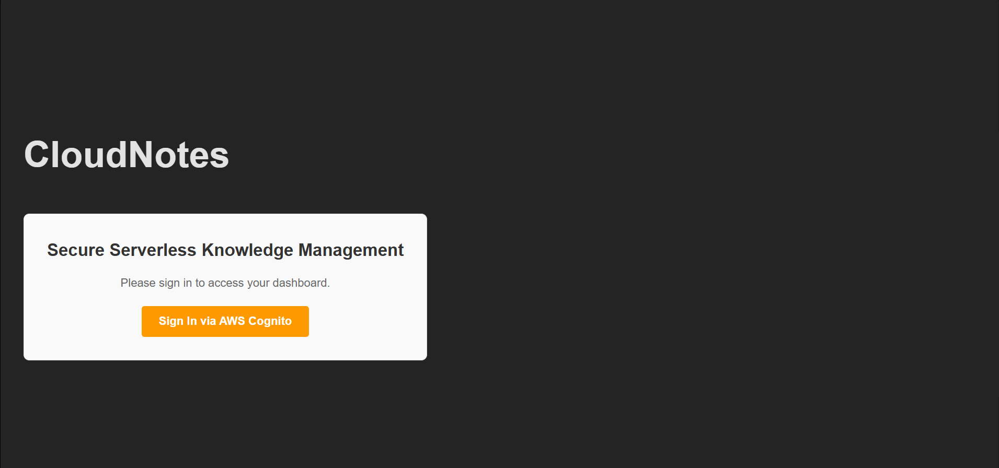
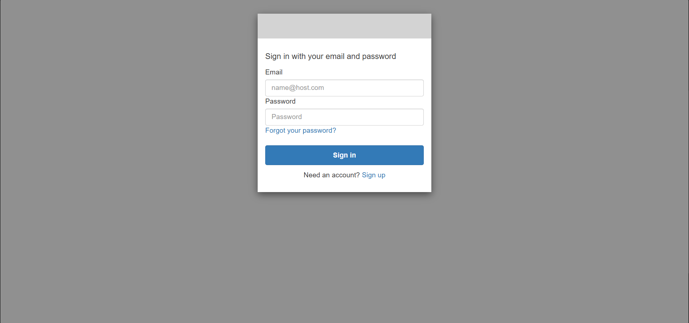
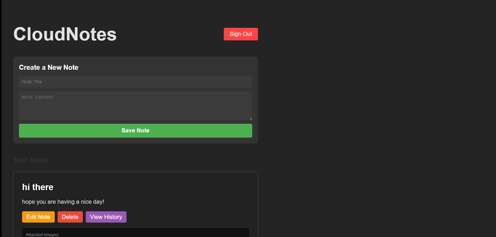
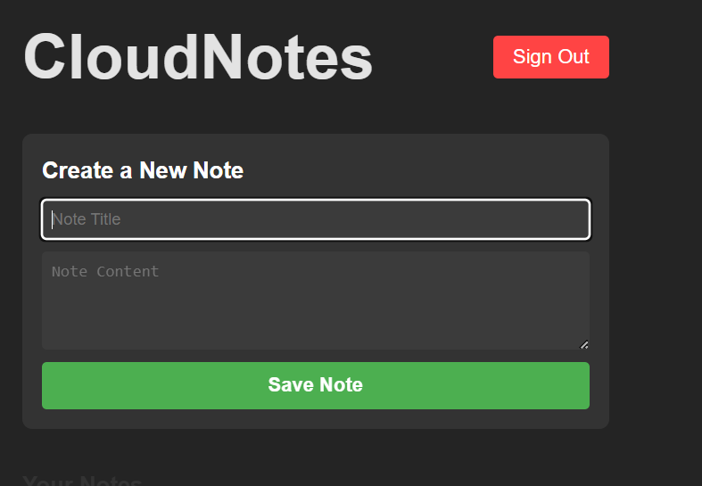
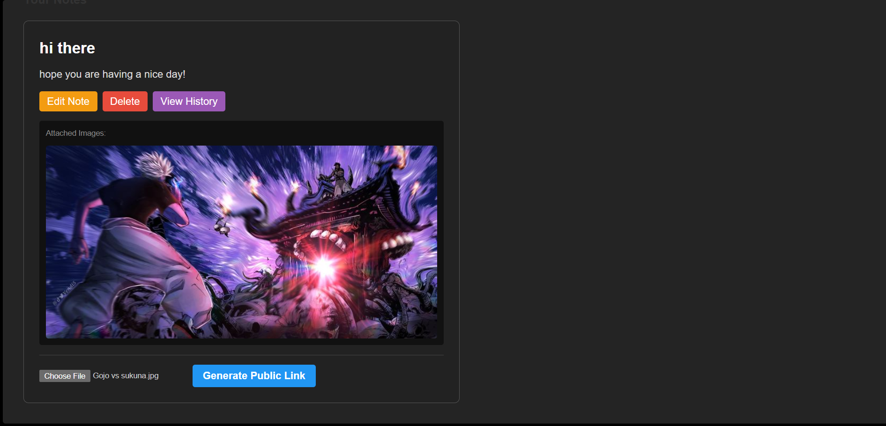
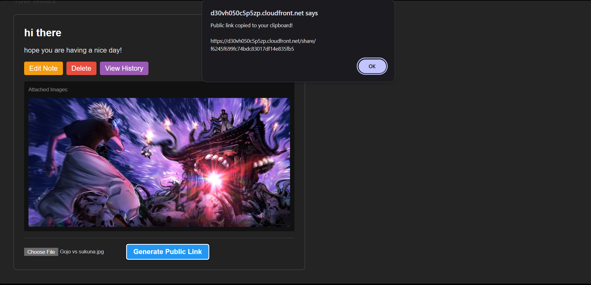
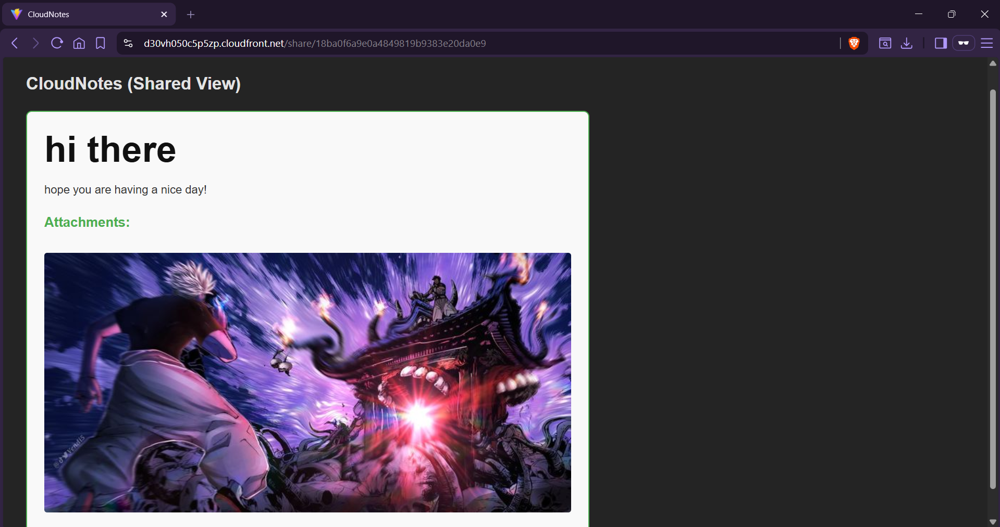

# CloudNotes ☁️📝

CloudNotes is a fully serverless, secure, and highly available note-taking application deployed natively on AWS. Built with a modern React frontend and a Python backend, it leverages the power of AWS managed services for infinite scalability and zero-maintenance infrastructure.

## 📸 UI Showcase

<details open>
<summary><b>View Application Screenshots</b></summary>

### 1. Welcome & Authentication

<br/>


### 2. Dashboard & Note Management

<br/>


### 3. Secure Attachments & Sharing

<br/>

<br/>


</details>


## Features
- **Secure Authentication:** User sign-up, verification, and login powered by Amazon Cognito.
- **Note Management:** Create, read, update, and delete markdown-style notes.
- **Rich Media Attachments:** Attach images securely directly to notes via pre-signed S3 URLs.
- **Version History:** Automatic tracking of note edits with a full historical timeline.
- **Secure Sharing:** Generate time-limited, read-only shareable links to collaborate with public viewers.

## Architecture
- **Frontend:** React (Vite) hosted natively on an Amazon S3 Bucket and distributed globally via CloudFront with OAC (Origin Access Control).
- **Backend API:** AWS HTTP API Gateway securely routing requests to an AWS Lambda function (Python 3.12).
- **Database:** Amazon DynamoDB tables for rapid, NoSQL document storage.
- **Storage:** Amazon S3 for storing encrypted user-uploaded image attachments.
- **Infrastructure as Code:** 100% of the architecture is codified using HashiCorp Terraform.

## Deployment Guide

### 1. Provision Infrastructure
Navigate to the `terraform/` directory and deploy the AWS resources.
```bash
cd terraform
terraform init
terraform apply
```
*Note: Terraform will output your new endpoints, including the `cloudfront_url`, `frontend_bucket`, and `api_base_url`.*

### 2. Configure Environment
Create a `.env` file in the `frontend/` directory (you can copy `.env.example` as a template) and populate it with the newly generated Terraform outputs:
```env
VITE_API_BASE_URL=https://...
VITE_COGNITO_DOMAIN=https://...
VITE_CLIENT_ID=...
VITE_REDIRECT_URI=https://...
```

### 3. Build & Deploy Frontend
Install dependencies, build the React app, and securely sync the compiled output to your new S3 frontend bucket:
```bash
cd frontend
npm install
npm run build
aws s3 sync dist/ s3://<YOUR_FRONTEND_BUCKET_NAME> --delete
```

**Your app is now live and accessible globally at your CloudFront URL!**
